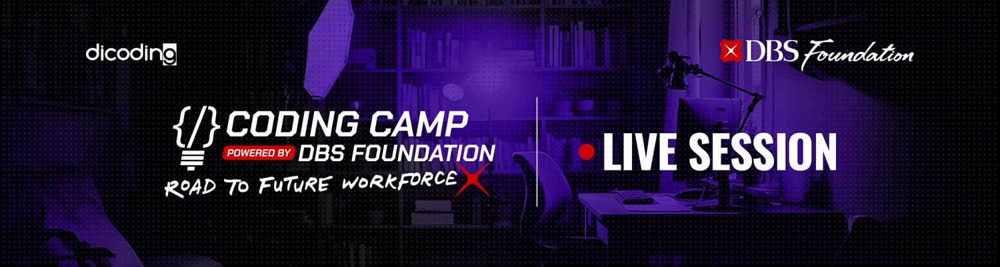

# IllDetect: Sistem Deteksi Risiko Penyakit Kardiovaskular

  

## Ringkasan
IllDetect adalah proyek sistem deteksi risiko penyakit kardiovaskular berbasis web yang mengintegrasikan machine learning dan teknologi web modern untuk skrining mandiri, prediksi risiko, dan edukasi kesehatan jantung.

## Latar Belakang Masalah
Penyakit kardiovaskular merupakan penyebab utama kematian di dunia dan sering tidak terdeteksi sejak dini. Banyak individu tidak menyadari risiko yang dimiliki akibat keterbatasan akses pemeriksaan kesehatan rutin maupun kurangnya pengetahuan terkait faktor risiko. Teknologi machine learning dapat membantu mengidentifikasi risiko secara otomatis berdasarkan data kesehatan individu. Namun, masih terbatas platform yang memungkinkan masyarakat melakukan skrining risiko penyakit kardiovaskular secara mandiri, akurat, dan mudah digunakan.

## Rumusan Masalah
1. Bagaimana penerapan machine learning serta pengembangan front-end dan back-end dapat membantu mengidentifikasi individu dengan risiko tinggi penyakit kardiovaskular berdasarkan data medis?
2. Bagaimana sistem dapat memprediksi risiko penyakit kardiovaskular serta memberikan saran pencegahan berbasis hasil prediksi secara akurat dan ramah pengguna?

## Tim Pengembang

  <h3>🌟 Tim Pengembang IllDetect - CC25-CF225 🌟</h3>
  
<i>Menghadirkan Inovasi untuk Deteksi Kesehatan Kardiovaskular</i>

<table>
  <tr>
    <th width="50%">🧠 Tim Machine Learning</th>
    <th width="50%">💻 Tim Full-Stack Development</th>
  </tr>
  <tr>
    <td valign="top">
      <ul>
        <li>
          <strong>Marsha Rasyida Al-Farabi</strong> 
          <em>ML Lead & Data Scientist</em> 
          🏫 Universitas Gadjah Mada 
          🆔 MC008D5X2348 
          <small>💡 Keahlian: Analisis Data, Feature Engineering, Pengembangan Model</small> 
          <b>Kontak:</b>
          <!-- Kontak menggunakan tabel dan icon agar lebih rapi -->
          <table>
            <tr>
              <td>📸 Instagram</td>
              <td><a href="#">[Tambahkan Akun]</a></td>
            </tr>
            <tr>
              <td>💼 LinkedIn</td>
              <td><a href="#">[Tambahkan Akun]</a></td>
            </tr>
            <tr>
              <td>🌐 Portofolio</td>
              <td><a href="#">[Tambahkan Link]</a></td>
            </tr>
          </table>
        </li>
        <li>
          <strong>Syifa Azzahra Susilo</strong> 
          <em>ML Engineer</em> 
          🏫 Universitas Gadjah Mada 
          🆔 MC008D5X2087 
          <small>💡 Keahlian: Pelatihan Model, Optimasi Hyperparameter</small> 
          <b>Kontak:</b>
          <!-- Kontak menggunakan tabel dan icon agar lebih rapi -->
          <table>
            <tr>
              <td>📸 Instagram</td>
              <td><a href="#">[Tambahkan Akun]</a></td>
            </tr>
            <tr>
              <td>💼 LinkedIn</td>
              <td><a href="#">[Tambahkan Akun]</a></td>
            </tr>
            <tr>
              <td>🌐 Portofolio</td>
              <td><a href="#">[Tambahkan Link]</a></td>
            </tr>
          </table>
        </li>
        <li>
          <strong>Indara Nurwulandari</strong> 
          <em>Data Engineer</em> 
          🏫 Universitas Gadjah Mada 
          🆔 MC008D5X2388 
          <small>💡 Keahlian: Pra-pemrosesan Data, Evaluasi Model</small> 
          <b>Kontak:</b>
          <!-- Kontak menggunakan tabel dan icon agar lebih rapi -->
          <table>
            <tr>
              <td>📸 Instagram</td>
              <td><a href="#">[Tambahkan Akun]</a></td>
            </tr>
            <tr>
              <td>💼 LinkedIn</td>
              <td><a href="#">[Tambahkan Akun]</a></td>
            </tr>
            <tr>
              <td>🌐 Portofolio</td>
              <td><a href="#">[Tambahkan Link]</a></td>
            </tr>
          </table>
        </li>
      </ul>
    </td>
    <td valign="top">
      <ul>
        <li>
          <strong>Muhammad Novian</strong> 
          <em>Full-Stack Lead</em> 
          🏫 Universitas Muhammadiyah Yogyakarta 
          🆔 FC492D5Y2169 
          <small>💡 Keahlian: Desain Frontend, Integrasi Backend</small> 
          <b>Kontak:</b>
          <!-- Kontak menggunakan tabel dan icon agar lebih rapi -->
          <table>
            <tr>
              <td>📸 Instagram</td>
              <td><a href="#">[Tambahkan Akun]</a></td>
            </tr>
            <tr>
              <td>💼 LinkedIn</td>
              <td><a href="#">[Tambahkan Akun]</a></td>
            </tr>
            <tr>
              <td>🌐 Portofolio</td>
              <td><a href="#">[Tambahkan Link]</a></td>
            </tr>
          </table>
        </li>
        <li>
          <strong>Muh Diaz Nazarudin Rahman</strong> 
          <em>Backend Developer</em> 
          🏫 Universitas Ahmad Dahlan 
          🆔 FC179D5Y0593 
          <small>💡 Keahlian: Pengembangan API, Manajemen Basis Data</small> 
          <b>Kontak:</b>
          <!-- Kontak menggunakan tabel dan icon agar lebih rapi -->
          <table>
            <tr>
              <td>📸 Instagram</td>
              <td><a href="#">[Tambahkan Akun]</a></td>
            </tr>
            <tr>
              <td>💼 LinkedIn</td>
              <td><a href="#">[Tambahkan Akun]</a></td>
            </tr>
            <tr>
              <td>🌐 Portofolio</td>
              <td><a href="#">[Tambahkan Link]</a></td>
            </tr>
          </table>
        </li>
        <li>
          <strong>Aditya Navra Erlangga</strong> 
          <em>Frontend Developer</em> 
          🏫 Universitas Ahmad Dahlan 
          🆔 FC179D5Y1055 
          <small>💡 Keahlian: Desain UI/UX, Pengembangan Web Responsif</small> 
          <b>Kontak:</b>
          <!-- Kontak menggunakan tabel dan icon agar lebih rapi -->
          <table>
            <tr>
              <td>📸 Instagram</td>
              <td><a href="#">[Tambahkan Akun]</a></td>
            </tr>
            <tr>
              <td>💼 LinkedIn</td>
              <td><a href="#">[Tambahkan Akun]</a></td>
            </tr>
            <tr>
              <td>🌐 Portofolio</td>
              <td><a href="#">[Tambahkan Link]</a></td>
            </tr>
          </table>
        </li>
      </ul>
    </td>
  </tr>
</table>

  <h4>💪 Bersama, kami membangun masa depan skrining kesehatan kardiovaskular! 💪</h4>

## Fitur Utama

- **Prediksi Risiko**: Analisis data kesehatan untuk menilai tingkat risiko kardiovaskular
- **Rekomendasi Personal**: Saran kesehatan yang disesuaikan berdasarkan faktor risiko
- **Dukungan PWA**: Dapat diinstal sebagai aplikasi mandiri pada perangkat mobile dan desktop
- **Kemampuan Offline**: Fitur inti tetap dapat digunakan tanpa koneksi internet
- **Desain Responsif**: Dioptimalkan untuk semua ukuran perangkat
- **Privasi Utama**: Semua pemrosesan terjadi secara lokal, tidak ada data yang dikirim ke server

## Teknologi yang Digunakan

### Machine Learning
- Python 3.8+
- Pandas & NumPy
- Matplotlib & Seaborn
- Scikit-learn
- TensorFlow/Keras
- PyTorch TabNet
- TensorFlow.js

### Web & Deployment
- React.js
- HTML5/CSS3
- JavaScript
- Bootstrap
- Flask
- Docker
- Google Cloud Platform
- GitHub Actions
- TailwindCSS (untuk styling frontend)
- Vite (build tool)
- Service Worker & Web Manifest (untuk PWA)

## Struktur Proyek

### machine-learning
- **IllDetect_Capstone_Project.ipynb**: Notebook utama analisis, eksplorasi, pemodelan, evaluasi, dan penyimpanan model.
- **tfjs_model/**: Model hasil pelatihan yang telah dikonversi ke TensorFlow.js (`model.json` dan bobot).
- **model_best.h5**: Model Keras terbaik (HDF5).
- **Deskripsi Dataset**: Dataset dari Kaggle, penjelasan variabel dan preprocessing di notebook.

### frontend-backend
- **frontend/**: Kode sumber aplikasi web (React.js).
- **backend/**: Kode backend server (Flask), termasuk endpoint API dan pemanggilan model.
- **Dokumentasi API**: Penjelasan endpoint dan penggunaan API.
- **File Deployment**: Konfigurasi deployment cloud.
- **Skema Basis Data**: Struktur dan relasi basis data.
- **Server Scripts**: Kode backend untuk permintaan dan menjalankan model ML.

## Cara Penggunaan Machine Learning

### Menjalankan Notebook
1. Pastikan dependencies terinstal (lihat requirements pada notebook).
2. Buka `IllDetect_Capstone_Project.ipynb` di Jupyter Notebook/Colab.
3. Jalankan sel secara berurutan.

### Inferensi Model
Model dapat digunakan untuk memprediksi risiko penyakit kardiovaskular menggunakan data baru. Lihat contoh dan detail pada notebook.

### Deployment Web dengan TensorFlow.js
Gunakan folder `tfjs_model/` (berisi `model.json` dan bobot) dan load model di aplikasi web menggunakan TensorFlow.js. Pastikan input dinormalisasi sesuai preprocessing training.

### Parameter Input Model
| Parameter    | Deskripsi           | Nilai/Format                  |
|--------------|---------------------|-------------------------------|
| age          | Usia (hari)         | Numeric (standardized)        |
| gender       | Jenis kelamin       | 1=Perempuan, 2=Laki-laki      |
| height       | Tinggi (cm)         | Numeric (standardized)        |
| weight       | Berat (kg)          | Numeric (standardized)        |
| ap_hi        | Tekanan sistolik    | Numeric (standardized)        |
| ap_lo        | Tekanan diastolik   | Numeric (standardized)        |
| cholesterol  | Level kolesterol    | 1=Normal, 2=Di atas normal, 3=Tinggi |
| gluc         | Level glukosa       | 1=Normal, 2=Di atas normal, 3=Tinggi |
| smoke        | Merokok             | 0=Tidak, 1=Ya                 |
| alco         | Alkohol             | 0=Tidak, 1=Ya                 |
| active       | Aktif fisik         | 0=Tidak, 1=Ya                 |

### Output Model
- **0**: Tidak berisiko penyakit kardiovaskular
- **1**: Berisiko penyakit kardiovaskular

## Instalasi & Deployment Web

1. Clone repositori dan instal dependensi sesuai petunjuk pada masing-masing folder.
2. Jalankan server pengembangan dan build untuk produksi sesuai dokumentasi frontend/backend.

## Instalasi PWA

1. Buka aplikasi di browser yang mendukung PWA.
2. Klik ikon instalasi di bilah alamat/menu.
3. Ikuti instruksi untuk menambah ke layar utama/desktop.

## Lisensi

Proyek ini dilisensikan di bawah MIT License – lihat file LICENSE untuk detail lebih lanjut.

---

  

